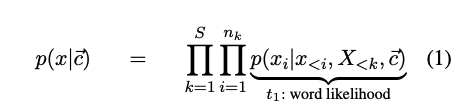
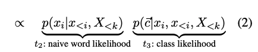
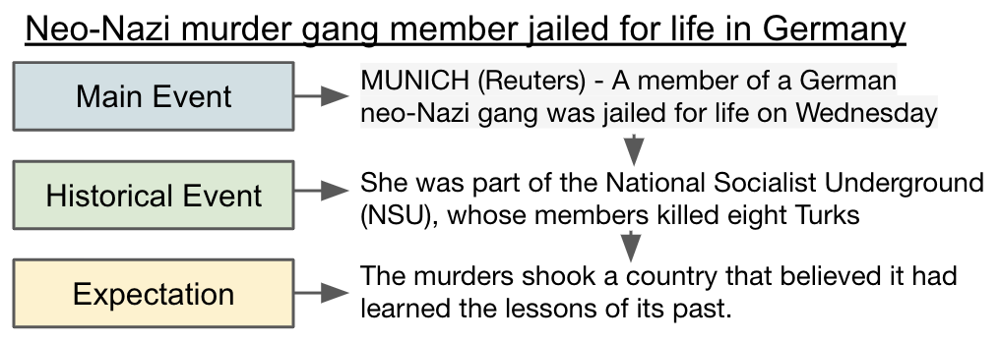

# controlled-sequence-generation

Here we provide code implementation for our recently accepted EMNLP 2023 Findings paper:

Spangher, Alexander, et al. "Sequentially Controlled Text Generation." arXiv preprint arXiv:2301.02299 (2023).
https://arxiv.org/pdf/2301.02299

## Goal 
Previous attempts at language modeling, we find, generate fluent and legible documents that nevertheless fail to follow typical writing structures present in human writing. For example, the _inverse pyramid_ is a common rhetorical structure used by journalists to write news articles: the most important information is presented first, followed by context, background, and analysis. We find, in our paper, that although GPT2 generates articles that _seem_ human-like in their structure, even the famous Ovid's Unicorn is decidedly not human-like.

Given that (1) enormous amounts of web-data are needed to train vanilla generation models to output fluent sentences (whereas document-level structure would likely require far more data), and (2) human rhetorical patterns are indeed identified, taught, discussed and modified by human writers, we doubt that pretraining alone will ever induce natural, human-like document structure. Additionally, the same idea might be expressed via several document structures: short summaries, longer articles, articles with more context, articles with more analysis.

So, here we define a new task, _Sequentially Controlled Text Generation_, where we assume we wish to generate text according to a sequence of class labels. We extend prior work in _Controlled Text Generation_ whereby text is generated according to a single label.

Here is our problem forumation:

Here is an example of an article structure:

<figure class="image">

<figcaption>A sample rhetorical structure that we might wish a news article to start with. In our models, user inputs the headline of the desired news article as well as a sequence of class labels to indicate the structure.</figcaption>
</figure>

## Repository Overview

The code necessary to train the various components of our work is given in the following sections:

* `/generator`: The main section, this compares several methos for generating sequentially controlled documents.
* `/discriminator`: Sentence-level classification models, needed to guide the document generation towards sequences of sentence tags.
* `/editing`: An add-on after generating sentences, the editor will edit the document to further induce class-aware structure, while, we find, also improving overall fluency.
* `/fine_tuning`: Further pretrain language models for specific domains, like news.
* `/evaluation`: Our crowdsourcing framework for evaluation.
* `/explanation`: Experiments using Integrated Gradients and other methods to learn explanations for class labels. Primarily used in our experimentations with `/editing`.

To see more details about running the generation, please see `run_generator.md`

Documentation is generally lacking, we are working to improve this. Please reach out to spangher@usc.edu for further questions.